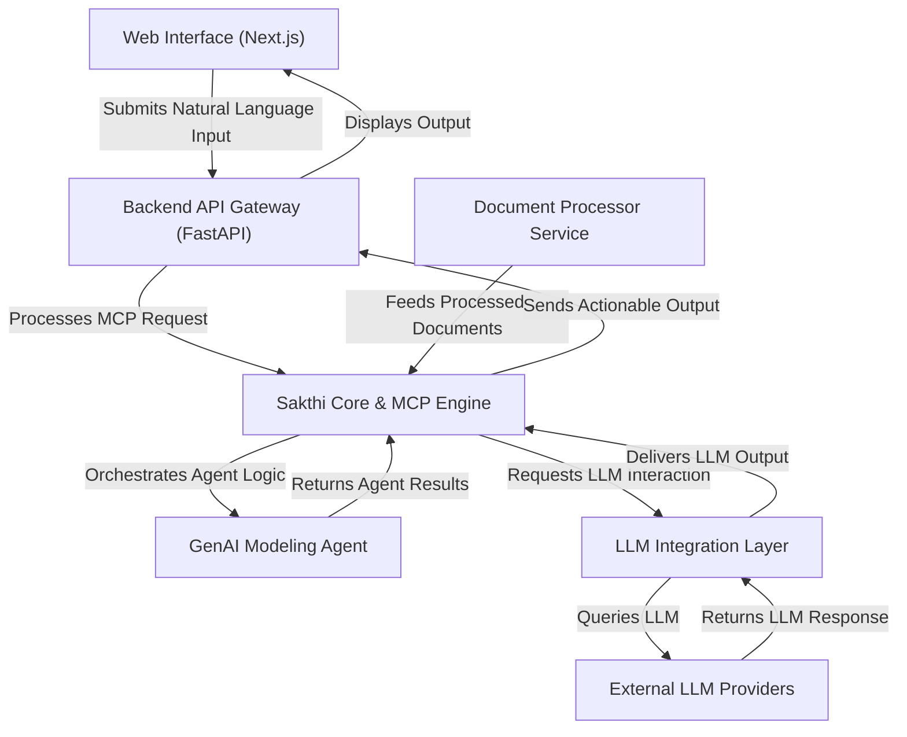

# Sakthi Platform

## Overview
The Sakthi Platform is an enterprise-grade, AI-powered system engineered to transform natural language inputs into actionable, structured outputs. At its core, the MCP Language (Sakthi) provides a specialized framework for designing and executing Model Context Protocols (MCP) in Natural Language Processing. This Python-based platform offers a structured approach to managing context-aware workflows, semantic parsing, and seamless integration with Large Language Models (LLMs) like DeepSeek LLM. Leveraging ChromaDB for Retrieval-Augmented Generation (RAG) and LangGraph for workflow orchestration, Sakthi delivers scalable, context-aware solutions for diverse enterprise challenges, including schema transformation, document processing, and complex workflow orchestration, complete with real-time monitoring, dynamic rule processing, and multi-format output generation.

## Business Problem
Modern enterprises are consistently challenged by the need to convert unstructured natural language data or complex, domain-specific requests into precise, actionable, and structured outputs. This encompasses critical tasks such as migrating database schemas across platforms, extracting specific information from varied document types (PDFs, spreadsheets), and orchestrating sophisticated workflows based solely on high-level natural language instructions. Manual execution of these processes is inherently slow, prone to errors, and lacks the necessary scalability and context-awareness required in today's fast-paced environment. The Sakthi Platform directly addresses these pain points by offering an automated, AI-driven solution that intelligently understands natural language intent, leverages historical context for enhanced accuracy, and generates exact, actionable outputs across a multitude of enterprise use cases.

## Key Capabilities
*   **Natural Language Interface**: Process complex tasks and queries using plain English, such as "Convert Oracle HR schema to BigQuery," "Extract revenue data from this PDF," or "Monitor competitor pricing daily."
*   **AI-Powered Processing**: Utilizes advanced LLMs (e.g., DeepSeek-Coder-6.7B, Codestral-22B) for intent recognition, SQL generation, data transformation, and code-related tasks.
*   **Context-Aware Workflows (RAG)**: Leverages ChromaDB for Retrieval-Augmented Generation (RAG) to incorporate historical context, past interactions, and relevant data, ensuring smarter and more accurate results.
*   **Dynamic Rule Processing**: Applies predefined business rules from a `rules.csv` file for conditional logic, SQL validations, and data integrity checks.
*   **Batch Processing**: Efficiently handles large datasets and complex operations, such as processing up to 1000 target fields simultaneously with the `EnhancedTargetProcessor`.
*   **Multi-format Outputs**: Generates diverse output formats including JSON, SQL scripts, CSV, and API-ready data structures, adaptable to various downstream systems.
*   **Workflow Orchestration & Monitoring**: Employs LangGraph to orchestrate complex AI workflows, monitor progress, and manage state across multi-step processes.
*   **Document Processing**: Capable of handling multi-format documents (PDF, XLSX, CSV) for data extraction and analysis.
*   **Backend Services/APIs**: Provides a well-defined FastAPI backend for programmatic access and seamless integration with other systems.
*   **Web Interface**: Features an interactive Next.js dashboard for intuitive user interaction, task submission, and visualization of results.
*   **Enterprise-Grade Deployment**: Designed for robust deployment, supporting Dockerization, Kubernetes readiness, Nginx proxying, and WebSocket-based real-time updates.

## Tech Stack
*   **Core Language**: Python
*   **LLMs**: DeepSeek LLM (e.g., DeepSeek-Coder-6.7B, Codestral-22B)
*   **Vector Database**: ChromaDB
*   **Workflow Orchestration**: LangGraph
*   **Backend Framework**: FastAPI
*   **Frontend Framework**: Next.js
*   **Package Management (Frontend)**: Node.js / npm
*   **Containerization**: Docker
*   **Orchestration**: Kubernetes
*   **Web Server/Proxy**: Nginx
*   **Real-time Communication**: WebSockets

## Repository Structure

```plaintext
sakthi-platform/
├── .gitignore
├── LICENSE
├── README.md
├── automated_setup_script.py # Placeholder or utility script
├── backend/                  # FastAPI backend and API endpoints
│   ├── main.py
│   ├── api/
│   ├── requirements.txt
│   └── Dockerfile
├── config/                   # Configuration files and environment variables
│   ├── prompt_template.json
│   └── .env
├── core.py                   # Potentially a core utility script or part of Sakthi Language
├── deployment/               # Deployment configurations (Docker, Kubernetes, Nginx)
│   ├── docker-compose.yml
│   ├── kubernetes/
│   │   └── sakthi-platform.yaml
│   ├── nginx.conf
│   └── launch_enhanced_llm_servers.sh # LLM server startup script
├── docs/                     # Project documentation
├── document-processor/       # Service for handling multi-format documents (PDF, XLSX, CSV)
│   ├── processor.py
│   └── Dockerfile
├── genai-modeling-agent/     # AI agents with AutoGen + LangGraph for LLM workflows
│   ├── agent_system.py
│   └── Dockerfile
├── logs/                     # Log storage
├── output/                   # Generated outputs (JSON, SQL, CSV)
├── sakthi-language/          # Core Sakthi Engine (MCP Language implementation)
│   └── core.py
├── sakthi-llm-integration/   # Integration layer for LLMs (e.g., DeepSeek)
│   └── llm_provider.py
├── sakthi_architecture.svg   # Visual representation of the architecture
├── storage/                  # General data storage
├── tests/                    # Unit and integration tests
├── uploads/                  # User uploaded files (PDF, XLSX, CSV)
└── web-interface/            # Next.js frontend
    ├── pages/
    ├── components/
    │   └── Dashboard.jsx
    ├── package.json
    └── Dockerfile
```

**Artifact-to-File Mapping:**

| Artifact Name                           | File Location                            |
| :-------------------------------------- | :--------------------------------------- |
| Sakthi Language - Core Implementation   | `sakthi-language/core.py`                |
| Document Processing Layer               | `document-processor/processor.py`        |
| GenAI Modeling Agent                    | `genai-modeling-agent/agent_system.py`   |
| DeepSeek LLM Integration                | `sakthi-llm-integration/llm_provider.py` |

## Local Setup
To get the Sakthi Platform running on your local machine, follow these steps. The recommended approach utilizes Docker Compose for a streamlined setup.

1.  **Clone the repository:**
    ```bash
    git clone https://github.com/ramamurthy-540835/sakthi-platform.git
    cd sakthi-platform
    ```

2.  **Configure Environment Variables:**
    Create a `.env` file in the `config/` directory. This file will hold configurations for LLM API keys, database connections (e.g., ChromaDB path), and other service settings.
    ```bash
    touch config/.env
    # Add necessary environment variables, e.g.:
    # DEEPSEEK_API_KEY="your_deepseek_api_key"
    # CHROMA_DB_PATH="/app/chromadb" # Or a local path
    # LLM_MODEL_NAME="deepseek-coder"
    ```

3.  **Using Docker Compose (Recommended):**
    Navigate to the `deployment/` directory and use Docker Compose to build and run all services (backend, frontend, document processor, genai agent, ChromaDB, etc.). Ensure Docker Desktop is running.
    ```bash
    cd deployment/
    docker-compose up --build -d
    ```
    This command will build the Docker images for all services and start them in detached mode.

4.  **Access the Application:**
    *   **Frontend**: Once services are up, access the Next.js web interface, typically at `http://localhost:3000` (or as configured in `docker-compose.yml`).
    *   **Backend API**: The FastAPI backend will be available, usually at `http://localhost:8000/docs` for interactive API documentation.

## Deployment
The Sakthi Platform is designed for robust and scalable deployment across various environments, from local development to production-grade cloud infrastructure.

1.  **Docker Compose (Local/Development):**
    As detailed in the `Local Setup` section, `docker-compose.yml` in the `deployment/` directory provides a quick and efficient way to deploy all services on a single host for development, testing, or smaller-scale operations.
    ```bash
    cd deployment/
    docker-compose up -d
    ```

2.  **Kubernetes (Production-Grade):**
    For enterprise-grade, highly available, and scalable deployments, the platform supports Kubernetes. The `deployment/kubernetes/sakthi-platform.yaml` file contains the necessary configurations for deploying services as pods, deployments, and services within a Kubernetes cluster.
    ```bash
    kubectl apply -f deployment/kubernetes/sakthi-platform.yaml
    ```
    This configuration typically includes services for the backend, frontend, document processor, and GenAI agent, alongside persistent storage configurations and necessary environment variable injections.

3.  **Nginx Proxying:**
    `nginx.conf` in the `deployment/` directory is provided for setting up Nginx as a reverse proxy. This is recommended for production deployments to handle SSL termination, load balancing, and efficient routing to the backend and frontend services, especially for WebSocket connections.
    ```nginx
    # Example Nginx configuration snippet
    server {
        listen 80;
        server_name yourdomain.com;

        location /api/ {
            proxy_pass http://backend:8000;
            proxy_set_header Host $host;
            proxy_set_header X-Real-IP $remote_addr;
            proxy_set_header X-Forwarded-For $proxy_add_x_forwarded_for;
            proxy_set_header X-Forwarded-Proto $scheme;
            # WebSocket support
            proxy_http_version 1.1;
            proxy_set_header Upgrade $http_upgrade;
            proxy_set_header Connection "upgrade";
        }

        location / {
            proxy_pass http://frontend:3000;
            proxy_set_header Host $host;
            proxy_set_header X-Real-IP $remote_addr;
            proxy_set_header X-Forwarded-For $proxy_add_x_forwarded_for;
        }
    }
    ```

4.  **LLM Server Management:**
    The `deployment/launch_enhanced_llm_servers.sh` script is a utility for starting external or dedicated LLM inference servers if models are not accessed via cloud APIs. This ensures optimized performance for LLM-intensive tasks.

## Demo Workflow
The Sakthi Platform enables users to interact with complex AI workflows through intuitive interfaces. A typical demo workflow for a schema transformation task would proceed as follows:

1.  **Access Web Interface / API**: A user or an integrated system accesses the Sakthi Platform via the Next.js web dashboard (`http://localhost:3000`) or directly through the FastAPI backend API (`http://localhost:8000/docs`).

2.  **Submit Natural Language Request**: The user submits a natural language query, such as "Convert the `HR.Employees` table from Oracle to a BigQuery-compatible schema, ensuring `salary` column uses `NUMERIC` type and `hire_date` uses `DATE` type, and exclude `SSN` column." Optionally, the user can upload a document (e.g., PDF schema definition) via the `uploads/` endpoint.

3.  **Initial Processing & Intent Recognition**: The FastAPI backend receives the request. The `genai-modeling-agent` (using `agent_system.py`) and `sakthi-language` modules come into play, utilizing DeepSeek LLM via `sakthi-llm-integration` to parse the natural language input, identify the intent (schema transformation), and extract key entities (source database, target database, table name, specific field transformations/exclusions).

4.  **Context Retrieval (RAG)**: The system queries ChromaDB to retrieve relevant historical schema transformation patterns, company-specific naming conventions, or data governance rules that apply to Oracle-to-BigQuery migrations. This context ensures the LLM generates highly accurate and compliant outputs.

5.  **Workflow Orchestration (LangGraph)**: LangGraph orchestrates the multi-step process:
    *   **Schema Analysis**: LLM analyzes the existing Oracle schema (if provided or inferred).
    *   **Transformation Logic Generation**: LLM generates the BigQuery DDL (Data Definition Language) script, adhering to the specified conditions (`NUMERIC` for salary, `DATE` for hire_date, exclusion of `SSN`).
    *   **Rule Application**: Dynamic rules from `rules.csv` are applied for validation (e.g., ensuring no sensitive data columns are accidentally included without explicit permission).

6.  **Output Generation**: The transformed schema in SQL DDL format is generated. The system can also provide outputs in JSON for API consumption or CSV for reporting.

7.  **Result Delivery**: The generated BigQuery DDL script is displayed on the web interface, downloadable, or returned as an API response. Real-time updates on the progress of the transformation are pushed to the frontend via WebSockets.

## Future Enhancements
*   **Expanded LLM and Model Support**: Integrate with a broader range of LLMs (e.g., Google Gemini, OpenAI GPT, open-source alternatives) and allow for fine-tuning of domain-specific models.
*   **Advanced Analytics and Reporting**: Develop comprehensive dashboards and reporting features to track task execution metrics, LLM performance, cost analysis, and usage patterns.
*   **Enhanced Security Features**: Implement robust authentication (e.g., OAuth2, SSO) and authorization (role-based access control) mechanisms across all services.
*   **Broader Enterprise Integrations**: Develop connectors for direct integration with more enterprise systems, such as CRMs, ERPs, data warehouses, and cloud services for automated data ingestion and output delivery.
*   **Self-Correction and Feedback Loop**: Implement mechanisms for users to provide feedback on generated outputs, which can be used to improve the underlying models and context retrieval over time.
*   **MLOps Integration**: Integrate with MLOps platforms for better management of model lifecycle, versioning, deployment, and monitoring in production environments.
*   **Cost Optimization Strategies**: Implement strategies for intelligent LLM call routing, caching, and prompt engineering to minimize operational costs.
*   **Multi-Modal Input Processing**: Extend document processing capabilities to handle more complex multi-modal inputs, including images with embedded text, audio, and video for information extraction.
## Architecture

Sakthi Platform: Model Context Protocol (MCP) framework for NLP and LLM integration.



For a standalone preview, see [docs/architecture.html](docs/architecture.html).

### Key Architectural Aspects:
* The Sakthi Platform utilizes a web interface (Next.js) for user interaction, connecting to a FastAPI-based backend.
* At its core, the Sakthi MCP Engine manages context-aware workflows, semantic parsing, and orchestrates tasks for GenAI Modeling Agents.
* The system seamlessly integrates with Large Language Models (LLMs) via a dedicated integration layer for context-driven decision-making.
* Leverages a Document Processor Service to feed contextual data into the Sakthi Core, enhancing workflow relevance.
