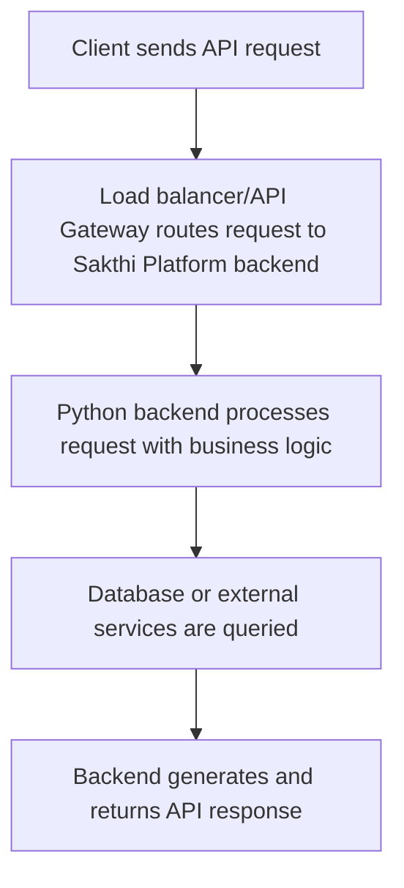

# Sakthi Platform

## Overview
The Sakthi Platform is an enterprise-grade, AI-powered system designed to transform natural language inputs into actionable outputs. At its core is the MCP Language (Sakthi), a specialized framework for designing and executing Model Context Protocols (MCP) in Natural Language Processing. It provides a structured approach to manage context-aware workflows, semantic parsing, and seamless integration with Large Language Models (LLMs) for context-driven decision-making and language transformations. Built primarily with Python, DeepSeek LLM, ChromaDB, and LangGraph, Sakthi delivers scalable, context-aware solutions for schema transformation, document processing, and complex workflow orchestration, complete with real-time monitoring, dynamic rule processing, and multi-format outputs.

## Business Problem
Modern enterprises face significant challenges in converting unstructured natural language data or complex domain-specific requests into actionable, structured outputs. This includes tasks such as migrating database schemas between different platforms, extracting specific information from diverse document types (PDFs, spreadsheets), and orchestrating complex workflows based on high-level natural language instructions. Manual approaches are slow, error-prone, and lack scalability and context-awareness. The Sakthi Platform addresses these challenges by providing an automated, AI-driven solution that understands natural language intent, leverages historical context, and generates precise, actionable outputs across various enterprise use cases.

## Key Capabilities
*   **Natural Language Interface**: Process complex tasks and queries using plain English, such as "Convert Oracle HR schema to BigQuery," "Extract revenue data from this PDF," or "Monitor competitor pricing daily."
*   **AI-Powered Processing**: Utilizes advanced LLMs like DeepSeek LLM (e.g., DeepSeek-Coder-6.7B, Codestral-22B) for intent recognition, SQL generation, data transformation, and code-related tasks.
*   **Context-Aware Workflows (RAG)**: Leverages ChromaDB for Retrieval-Augmented Generation (RAG) to incorporate historical context, past interactions, and relevant data, ensuring smarter and more accurate results.
*   **Dynamic Rule Processing**: Applies predefined business rules from a `rules.csv` file for conditional logic, SQL validations, and data integrity checks.
*   **Batch Processing**: Efficiently handles large datasets and complex operations, such as processing up to 1000 target fields simultaneously with the `EnhancedTargetProcessor`.
*   **Multi-format Outputs**: Generates diverse output formats including JSON, SQL scripts, CSV, and API-ready data structures, adaptable to various downstream systems.
*   **Workflow Orchestration & Monitoring**: Employs LangGraph to orchestrate complex AI workflows, monitor progress, and manage state across multi-step processes.
*   **Document Processing**: Capable of handling multi-format documents (PDF, XLSX, CSV) for data extraction and analysis.
*   **Backend Services/APIs**: Provides a well-defined FastAPI backend for programmatic access and integration with other systems.
*   **Web Interface**: Features an interactive Next.js dashboard for user interaction, task submission, and visualization of results.
*   **Enterprise-Grade Deployment**: Designed for robust deployment, supporting Dockerization, Kubernetes readiness, Nginx proxying, and WebSocket-based real-time updates.

## Tech Stack
*   **Core Language**: Python
*   **LLMs**: DeepSeek LLM (e.g., DeepSeek-Coder-6.7B, Codestral-22B)
*   **Vector Database**: ChromaDB
*   **Workflow Orchestration**: LangGraph
*   **Backend Framework**: FastAPI
*   **Frontend Framework**: Next.js
*   **Package Management (Frontend)**: Node.js / npm
*   **Containerization**: Docker
*   **Orchestration**: Kubernetes
*   **Web Server/Proxy**: Nginx
*   **Real-time Communication**: WebSockets

## Repository Structure

```plaintext
sakthi-platform/
├── .gitignore
├── LICENSE
├── README.md
├── automated_setup_script.py # Placeholder or utility script
├── backend/                  # FastAPI backend and API endpoints
│   ├── main.py
│   ├── api/
│   ├── requirements.txt
│   └── Dockerfile
├── config/                   # Configuration files and environment variables
│   ├── prompt_template.json
│   └── .env
├── core.py                   # Potentially a core utility script or part of Sakthi Language
├── deployment/               # Deployment configurations (Docker, Kubernetes, Nginx)
│   ├── docker-compose.yml
│   ├── kubernetes/
│   │   └── sakthi-platform.yaml
│   ├── nginx.conf
│   └── launch_enhanced_llm_servers.sh # LLM server startup script
├── docs/                     # Project documentation
├── document-processor/       # Service for handling multi-format documents (PDF, XLSX, CSV)
│   ├── processor.py
│   └── Dockerfile
├── genai-modeling-agent/     # AI agents with AutoGen + LangGraph for LLM workflows
│   ├── agent_system.py
│   └── Dockerfile
├── logs/                     # Log storage
├── output/                   # Generated outputs (JSON, SQL, CSV)
├── sakthi-language/          # Core Sakthi Engine (MCP Language implementation)
│   └── core.py
├── sakthi-llm-integration/   # Integration layer for LLMs (e.g., DeepSeek)
│   └── llm_provider.py
├── sakthi_architecture.svg   # Visual representation of the architecture
├── storage/                  # General data storage
├── tests/                    # Unit and integration tests
├── uploads/                  # User uploaded files (PDF, XLSX, CSV)
└── web-interface/            # Next.js frontend
    ├── pages/
    ├── components/
    │   └── Dashboard.jsx
    ├── package.json
    └── Dockerfile
```

**Artifact-to-File Mapping:**

| Artifact Name                           | File Location                            |
| :-------------------------------------- | :--------------------------------------- |
| Sakthi Language - Core Implementation   | `sakthi-language/core.py`                |
| Document Processing Layer               | `document-processor/processor.py`        |
| GenAI Modeling Agent                    | `genai-modeling-agent/agent_system.py`   |
| DeepSeek LLM Integration                | `sakthi-llm-integration/llm_provider.py` |

## Local Setup
To get the Sakthi Platform running on your local machine, follow these steps. The recommended approach utilizes Docker Compose for a streamlined setup.

1.  **Clone the repository:**
    ```bash
    git clone https://github.com/ramamurthy-540835/sakthi-platform.git
    cd sakthi-platform
    ```

2.  **Configure Environment Variables:**
    Create a `.env` file in the `config/` directory. This file will hold configurations for API keys, database connections, and other service settings.
    ```bash
    touch config/.env
    # Add necessary environment variables, e.g., DEEPSEEK_API_KEY, CHROMA_DB_PATH
    ```

3.  **Using Docker Compose (Recommended):**
    Navigate to the `deployment/` directory and use Docker Compose to build and run all services (backend, frontend, document processor, genai agent, ChromaDB, etc.). Ensure Docker Desktop is running.
    ```bash
    cd deployment/
    docker-compose up --build -d
    ```
    This command will build the Docker images for all services and start them in detached mode.

4.  **Access the Application:**
    *   **Frontend**: Once services are up, access the Next.js web interface, typically at `http://localhost:3000` (or as configured in `docker-compose.yml`).
    *   **Backend API**: The FastAPI backend will be available, usually at `http://localhost:8000/docs` for API documentation.

5.  **Manual Setup (Alternative for specific components):**
    If you need to run specific services individually (e.g., for development or debugging without Docker Compose):
    *   **Backend**:
        ```bash
        cd backend/
        pip install -r requirements.txt
        uvicorn main:app --host 0.0.0.0 --port 8000
        ```
    *   **Frontend**:
        ```bash
        cd web-interface/
        npm install
        npm run dev
        ```
    Ensure all necessary environment variables are set in your shell session for manual setup.

## Deployment
The Sakthi Platform is designed for robust, enterprise-grade deployment, leveraging containerization and orchestration technologies.

*   **Containerization**: All core services (backend, frontend, document processor, GenAI agent) are Dockerized, ensuring portability and consistent environments across different stages. Dockerfiles are provided within each service directory.
*   **Orchestration**: The platform is Kubernetes-ready, with example configurations provided in `deployment/kubernetes/sakthi-platform.yaml`. This allows for scalable deployments, automated load balancing, self-healing, and efficient resource management.
*   **Reverse Proxy & Load Balancing**: Nginx can be used as a reverse proxy for the frontend and backend services, as well as for handling WebSocket connections, providing enhanced security, caching, and load distribution. A sample `nginx.conf` is available in `deployment/`.
*   **Real-time Communication**: WebSockets are used for real-time updates and notifications, which are supported through Nginx proxying for robust production environments.
*   **LLM Servers**: Dedicated scripts (e.g., `deployment/launch_enhanced_llm_servers.sh`) are provided to manage the startup of LLM inference servers, which can be integrated into the containerized deployment strategy or run on specialized hardware.

For detailed deployment instructions for a production environment, refer to the documentation in the `docs/` directory.

## Demo Workflow
A typical user interaction with the Sakthi Platform, demonstrating its core capabilities, would follow this workflow:

1.  **Access Web Interface**: A user navigates to the Sakthi Platform's web dashboard (`http://localhost:3000` in a local setup).
2.  **Submit Natural Language Request**: On the dashboard, the user inputs a complex request in plain English, for example, "Convert the HR schema from Oracle to BigQuery, ensure all sensitive fields are masked, and output the SQL DDL."
3.  **Optional Document Upload**: If the task involves document processing (e.g., "Extract revenue data from this PDF"), the user uploads the relevant PDF or Excel file through the interface.
4.  **Backend Processing & Orchestration**:
    *   The web interface sends the request to the FastAPI backend.
    *   The backend initiates a complex workflow using LangGraph, leveraging the MCP Language (Sakthi) to break down the request.
    *   The `genai-modeling-agent` interacts with DeepSeek LLM via `sakthi-llm-integration` for semantic parsing, intent recognition, schema analysis, and SQL generation.
    *   ChromaDB is queried for historical context and relevant domain knowledge (RAG), enhancing the accuracy of LLM responses.
    *   Dynamic rules from `rules.csv` are applied for data validation, masking requirements, and conditional logic.
    *   If a document was uploaded, the `document-processor` service handles data extraction and pre-processing.
5.  **Real-time Monitoring**: The user can monitor the progress of their task on the dashboard, receiving real-time updates via WebSockets as the workflow progresses through its various stages.
6.  **Receive Multi-format Output**: Upon completion, the system generates the requested output, such as a BigQuery SQL DDL script, a JSON file with transformed data, or a CSV export. This output is stored in the `output/` directory and presented to the user on the dashboard, ready for download or further action.

## Future Enhancements
The Sakthi Platform is continuously evolving. Planned future enhancements include:

*   **Broader LLM Integration**: Expand support for a wider range of Large Language Models and cloud-based LLM APIs to offer more flexibility and options for performance and cost.
*   **Advanced Analytics & Reporting**: Integrate more sophisticated dashboards and reporting tools for deeper insights into workflow performance, LLM usage, and output quality.
*   **Enhanced Security & Access Control**: Implement granular Role-Based Access Control (RBAC) and integrate with enterprise identity management systems.
*   **Self-Learning Capabilities**: Develop mechanisms for the platform to learn from past interactions, user feedback, and corrected outputs to continuously improve its accuracy and context understanding.
*   **Pre-built Workflow Templates**: Offer a library of pre-defined, customizable MCP templates for common enterprise use cases to accelerate new project setups.
*   **Increased Data Source Connectivity**: Broaden native connectors to more enterprise data sources, including various databases, cloud storage, and SaaS applications.
## Architecture



For a standalone preview, see [docs/architecture.html](docs/architecture.html).
