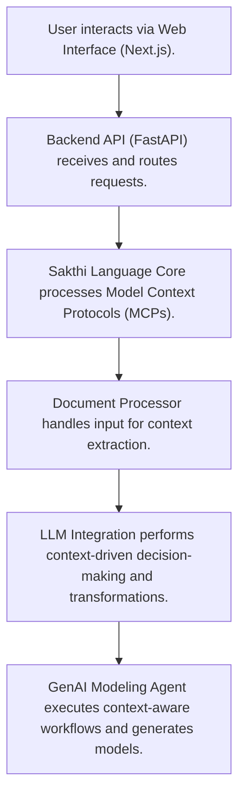

# Sakthi Platform

## Overview
The Sakthi Platform is an enterprise-grade, AI-powered system designed to transform natural language inputs into actionable outputs. At its core is the MCP Language (Sakthi), a specialized framework for designing and executing Model Context Protocols (MCP) in Natural Language Processing. It provides a structured approach to manage context-aware workflows, semantic parsing, and seamless integration with Large Language Models (LLMs) for context-driven decision-making and language transformations. Built with Python, DeepSeek LLM, ChromaDB, and LangGraph, Sakthi delivers scalable, context-aware solutions for schema transformation, document processing, and workflow orchestration, complete with real-time monitoring, dynamic rule processing, and multi-format outputs. The project repository is located at [ramamurthy-540835/sakthi-platform](https://github.com/ramamurthy-540835/sakthi-platform).

## Business Problem
Modern enterprises face significant challenges in converting unstructured natural language data or complex domain-specific requests into actionable, structured outputs. This includes tasks such as migrating database schemas between different platforms, extracting specific information from diverse document types (PDFs, spreadsheets), and orchestrating complex workflows based on high-level natural language instructions. Manual approaches are slow, error-prone, and lack scalability and context-awareness. The Sakthi Platform addresses these challenges by providing an automated, AI-driven solution that understands natural language intent, leverages historical context, and generates precise, actionable outputs across various enterprise use cases.

## Key Capabilities
*   **Natural Language Interface**: Process complex tasks and queries using plain English, such as "Convert Oracle HR schema to BigQuery," "Extract revenue data from this PDF," or "Monitor competitor pricing daily."
*   **AI-Powered Processing**: Utilizes advanced LLMs like DeepSeek LLM (e.g., DeepSeek-Coder-6.7B, Codestral-22B) for intent recognition, SQL generation, data transformation, and code-related tasks.
*   **Context-Aware Workflows (RAG)**: Leverages ChromaDB for Retrieval-Augmented Generation (RAG) to incorporate historical context, past interactions, and relevant data, ensuring smarter and more accurate results.
*   **Dynamic Rule Processing**: Applies predefined business rules from a `rules.csv` file for conditional logic, SQL validations, and data integrity checks.
*   **Batch Processing**: Efficiently handles large datasets and complex operations, such as processing up to 1000 target fields simultaneously with the `EnhancedTargetProcessor`.
*   **Multi-format Outputs**: Generates diverse output formats including JSON, SQL scripts, CSV, and API-ready data structures, adaptable to various downstream systems.
*   **Workflow Orchestration & Monitoring**: Employs LangGraph to orchestrate complex AI workflows, monitor progress, and manage state across multi-step processes.
*   **Document Processing**: Capable of handling multi-format documents (PDF, XLSX, CSV) for data extraction and analysis.
*   **Enterprise-Grade Deployment**: Designed for robust deployment, supporting Dockerization, Kubernetes readiness, Nginx proxying, and WebSocket-based real-time updates.
*   **Backend Services/APIs**: Provides a well-defined FastAPI backend for programmatic access and integration.
*   **Web Interface**: Features an interactive Next.js dashboard for user interaction and visualization.

## Tech Stack
*   **Core Language**: Python
*   **LLMs**: DeepSeek LLM (e.g., DeepSeek-Coder-6.7B, Codestral-22B)
*   **Vector Database**: ChromaDB
*   **Workflow Orchestration**: LangGraph
*   **Backend Framework**: FastAPI
*   **Frontend Framework**: Next.js
*   **Package Management (Frontend)**: Node.js / npm
*   **Containerization**: Docker
*   **Orchestration**: Kubernetes
*   **Web Server/Proxy**: Nginx
*   **Real-time Communication**: WebSockets

## Repository Structure

```plaintext
sakthi-platform/
├── .gitignore
├── LICENSE
├── README.md
├── automated_setup_script.py # Placeholder or utility script
├── backend/                  # FastAPI backend and API endpoints
│   ├── main.py
│   ├── api/
│   ├── requirements.txt
│   └── Dockerfile
├── config/                   # Configuration files and environment variables
│   ├── prompt_template.json
│   └── .env
├── core.py                   # Potentially a core utility script or part of Sakthi Language
├── deployment/               # Deployment configurations (Docker, Kubernetes, Nginx)
│   ├── docker-compose.yml
│   ├── kubernetes/
│   │   └── sakthi-platform.yaml
│   ├── nginx.conf
│   └── launch_enhanced_llm_servers.sh # LLM server startup script
├── docs/                     # Project documentation
├── document-processor/       # Service for handling multi-format documents (PDF, XLSX, CSV)
│   ├── processor.py
│   └── Dockerfile
├── genai-modeling-agent/     # AI agents with AutoGen + LangGraph for LLM workflows
│   ├── agent_system.py
│   └── Dockerfile
├── logs/                     # Log storage
├── output/                   # Generated outputs (JSON, SQL, CSV)
├── sakthi-language/          # Core Sakthi Engine (MCP Language implementation)
│   └── core.py
├── sakthi-llm-integration/   # Integration layer for LLMs (e.g., DeepSeek)
│   └── llm_provider.py
├── sakthi_architecture.svg   # Visual representation of the architecture
├── storage/                  # General data storage
├── tests/                    # Unit and integration tests
├── uploads/                  # User uploaded files (PDF, XLSX, CSV)
└── web-interface/            # Next.js frontend
    ├── pages/
    ├── components/
    │   └── Dashboard.jsx
    ├── package.json
    └── Dockerfile
```

**Artifact-to-File Mapping:**

| Artifact Name                           | File Location                            |
| :-------------------------------------- | :--------------------------------------- |
| Sakthi Language - Core Implementation   | `sakthi-language/core.py`                |
| Document Processing Layer               | `document-processor/processor.py`        |
| GenAI Modeling Agent                    | `genai-modeling-agent/agent_system.py`   |
| DeepSeek LLM Integration                | `sakthi-llm-integration/llm_provider.py` |

## Local Setup
To get the Sakthi Platform running on your local machine, follow these steps. The recommended approach utilizes Docker Compose for a streamlined setup.

1.  **Clone the repository:**
    ```bash
    git clone https://github.com/ramamurthy-540835/sakthi-platform.git
    cd sakthi-platform
    ```

2.  **Configure Environment Variables:**
    Create a `.env` file in the `config/` directory. This file will hold configurations for API keys, database connections, and other service settings.
    ```bash
    touch config/.env
    # Add necessary environment variables, e.g., DEEPSEEK_API_KEY, CHROMA_DB_PATH
    ```

3.  **Using Docker Compose (Recommended):**
    Navigate to the `deployment/` directory and use Docker Compose to build and run all services (backend, frontend, document processor, genai agent, ChromaDB, etc.). Ensure Docker Desktop is running.
    ```bash
    cd deployment/
    docker-compose up --build -d
    ```
    This command will build the Docker images for all services and start them in detached mode.

4.  **Access the Application:**
    *   **Frontend**: Once services are up, access the Next.js web interface, typically at `http://localhost:3000` (or as configured in `docker-compose.yml`).
    *   **Backend API**: The FastAPI backend will be available, usually at `http://localhost:8000/docs` for API documentation.

5.  **Manual Setup (Alternative for specific components):**
    If you need to run specific services individually (e.g., for development or debugging without Docker Compose):
    *   **Backend**:
        ```bash
        cd backend/
        pip install -r requirements.txt
        uvicorn main:app --reload --host 0.0.0.0 --port 8000
        ```
    *   **Frontend**:
        ```bash
        cd web-interface/
        npm install
        npm run dev
        ```
    *   Ensure any dependencies like ChromaDB are properly configured and running for standalone services.

## Deployment
The Sakthi Platform is designed for scalable and robust enterprise deployments, primarily leveraging containerization and orchestration technologies.

1.  **Containerization with Docker:**
    Each core service (`backend`, `web-interface`, `document-processor`, `genai-modeling-agent`) is provided with a `Dockerfile`, enabling consistent and isolated environments. These can be built individually and pushed to a container registry.
    ```bash
    # Example: Build backend image
    docker build -t your-registry/sakthi-backend:latest ./backend
    ```

2.  **Docker Compose (Single-Server / Local Production):**
    For deploying all services on a single server or for local production-like environments, `deployment/docker-compose.yml` provides a straightforward solution. This configuration handles inter-service communication, volume mapping, and environment variable injection.
    ```bash
    cd deployment/
    docker-compose -f docker-compose.yml up -d
    ```

3.  **Kubernetes (Production-Grade Scalability):**
    For high availability, scalability, and automated management in production, Kubernetes is the recommended orchestrator. The `deployment/kubernetes/sakthi-platform.yaml` file contains definitions for Deployments, Services, Ingresses, and other Kubernetes resources to manage the Sakthi Platform microservices.
    *   **Prerequisites**: A Kubernetes cluster (e.g., Minikube, EKS, GKE, AKS) and `kubectl` configured.
    *   **Deployment**:
        ```bash
        kubectl apply -f deployment/kubernetes/sakthi-platform.yaml
        ```
    *   Ensure Persistent Volumes are configured for ChromaDB and other stateful components.

4.  **Nginx Proxying:**
    For production deployments, Nginx (`deployment/nginx.conf`) can be used as a reverse proxy, load balancer, and to handle SSL termination. It provides an efficient entry point for external traffic to the `web-interface` and `backend` services.

5.  **Real-time Updates:**
    The platform supports WebSocket-based real-time communication, which should be configured to pass through proxies like Nginx correctly.

## Demo Workflow
The Sakthi Platform simplifies complex natural language processing tasks through an intuitive workflow, typically accessed via the web interface.

1.  **Access the Web Interface:**
    Open your web browser and navigate to the deployed Next.js frontend (e.g., `http://localhost:3000` or your production domain). The interactive dashboard provides the primary user interaction point.

2.  **Submit a Natural Language Query or Upload Document:**
    *   **Text Query**: In the input field, type a natural language instruction or query. For instance:
        *   "Convert my Oracle HR schema to BigQuery, focusing on employee and department tables."
        *   "Generate SQL to list all customers with orders placed in the last quarter."
    *   **Document Upload**: Use the provided upload functionality to submit documents (PDF, XLSX, CSV) for processing. For example, upload a financial report PDF with the instruction: "Extract all revenue figures from this Q3 financial report."

3.  **Automated Processing and Contextualization:**
    *   The request from the `web-interface` is sent to the `backend` FastAPI service.
    *   The `backend` orchestrates the workflow using LangGraph, involving the `sakthi-language` engine for intent parsing.
    *   The `genai-modeling-agent` integrates with DeepSeek LLM (via `sakthi-llm-integration`) to perform the core AI task.
    *   For document-related tasks, the `document-processor` parses the uploaded file.
    *   `ChromaDB` is leveraged for Retrieval-Augmented Generation (RAG) to inject relevant historical context or domain-specific knowledge, ensuring highly context-aware and accurate responses.
    *   Dynamic business rules from `rules.csv` are applied for validation and conditional logic.

4.  **View Real-time Results:**
    The results and workflow progress are streamed back to the `web-interface` via WebSockets.
    *   For schema conversion, generated SQL DDL statements will be displayed.
    *   For data extraction, structured JSON or CSV output will be presented.
    *   The dashboard provides status updates, intermediate steps, and the final actionable output.

5.  **Utilize Outputs:**
    The generated outputs (e.g., SQL scripts, JSON data) can be downloaded, copied, or directly used to drive downstream enterprise systems and processes.

## Future Enhancements
The Sakthi Platform is designed for continuous evolution. Potential future enhancements include:

*   **Expanded LLM Integration**: Support for a wider array of proprietary and open-source Large Language Models to offer greater flexibility and specialized capabilities across various domains.
*   **Advanced UI/UX**: Further enhancements to the web interface for more interactive visualizations, comprehensive workflow monitoring, and user-definable dashboards.
*   **Enhanced Rule Management UI**: A dedicated interface for managing, validating, and testing business rules, providing a more intuitive approach than file-based configurations.
*   **Multi-tenancy Support**: Implementation of features to securely isolate data and workflows for multiple organizations or departments within a single deployment.
*   **Integration Ecosystem**: Development of pre-built connectors and APIs for seamless integration with popular enterprise systems (e.g., CRM, ERP, BI tools, cloud data warehouses).
*   **Performance Optimizations**: Ongoing efforts to optimize latency for real-time interactions and throughput for large-scale batch processing, potentially involving dedicated GPU acceleration for LLM inference.
*   **Auditing and Compliance**: Advanced logging, auditing trails, and compliance features to meet stringent enterprise security and regulatory requirements.
*   **Voice and Multimodal Input**: Exploration of voice command interfaces and processing of other multimodal inputs alongside natural language and documents.
## Architecture



For a standalone preview, see [docs/architecture.html](docs/architecture.html).
