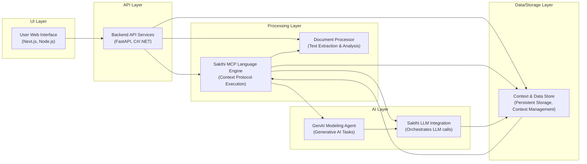

# Sakthi Platform

## Overview
The Sakthi Platform is an enterprise-grade, AI-powered system engineered to transform natural language inputs into actionable, structured outputs. At its core, the MCP Language (Sakthi) provides a specialized framework for designing and executing Model Context Protocols (MCP) in Natural Language Processing. This Python-based platform offers a structured approach to managing context-aware workflows, semantic parsing, and seamless integration with Large Language Models (LLMs) like DeepSeek LLM. Leveraging ChromaDB for Retrieval-Augmented Generation (RAG) and LangGraph for workflow orchestration, Sakthi delivers scalable, context-aware solutions for diverse enterprise challenges, including schema transformation, document processing, and complex workflow orchestration, complete with real-time monitoring, dynamic rule processing, and multi-format output generation.

## Business Problem
Modern enterprises are consistently challenged by the need to convert unstructured natural language data or complex, domain-specific requests into precise, actionable, and structured outputs. This encompasses critical tasks such as migrating database schemas across platforms, extracting specific information from varied document types (PDFs, spreadsheets), and orchestrating sophisticated workflows based solely on high-level natural language instructions. Manual execution of these processes is inherently slow, prone to errors, and lacks the necessary scalability and context-awareness required in today's fast-paced environment. The Sakthi Platform directly addresses these pain points by offering an automated, AI-driven solution that intelligently understands natural language intent, leverages historical context for enhanced accuracy, and generates exact, actionable outputs across a multitude of enterprise use cases.

## Key Capabilities
*   **Natural Language Interface**: Process complex tasks and queries using plain English, such as "Convert Oracle HR schema to BigQuery," "Extract revenue data from this PDF," or "Monitor competitor pricing daily."
*   **AI-Powered Processing**: Utilizes advanced LLMs (e.g., DeepSeek-Coder-6.7B, Codestral-22B) for intent recognition, SQL generation, data transformation, and code-related tasks.
*   **Context-Aware Workflows (RAG)**: Leverages ChromaDB for Retrieval-Augmented Generation (RAG) to incorporate historical context, past interactions, and relevant data, ensuring smarter and more accurate results.
*   **Dynamic Rule Processing**: Applies predefined business rules from a `rules.csv` file for conditional logic, SQL validations, and data integrity checks.
*   **Batch Processing**: Efficiently handles large datasets and complex operations, such as processing up to 1000 target fields simultaneously with the `EnhancedTargetProcessor`.
*   **Multi-format Outputs**: Generates diverse output formats including JSON, SQL scripts, CSV, and API-ready data structures, adaptable to various downstream systems.
*   **Workflow Orchestration & Monitoring**: Employs LangGraph to orchestrate complex AI workflows, monitor progress, and manage state across multi-step processes.
*   **Document Processing**: Capable of handling multi-format documents (PDF, XLSX, CSV) for data extraction and analysis.
*   **Backend Services/APIs**: Provides a well-defined FastAPI backend for programmatic access and seamless integration with other systems.
*   **Web Interface**: Features an interactive Next.js dashboard for intuitive user interaction, task submission, and visualization of results.
*   **Enterprise-Grade Deployment**: Designed for robust deployment, supporting Dockerization, Kubernetes readiness, Nginx proxying, and WebSocket-based real-time updates.

## Tech Stack
*   **Core Language**: Python
*   **LLMs**: DeepSeek LLM (e.g., DeepSeek-Coder-6.7B, Codestral-22B)
*   **Vector Database**: ChromaDB
*   **Workflow Orchestration**: LangGraph
*   **Backend Framework**: FastAPI
*   **Frontend Framework**: Next.js
*   **Package Management (Frontend)**: Node.js / npm
*   **Containerization**: Docker
*   **Orchestration**: Kubernetes
*   **Web Server/Proxy**: Nginx
*   **Real-time Communication**: WebSockets

## Repository Structure

```plaintext
sakthi-platform/
├── .gitignore
├── LICENSE
├── README.md
├── automated_setup_script.py # Utility script or placeholder for automated tasks
├── backend/                  # FastAPI backend and API endpoints
│   ├── main.py
│   ├── api/
│   ├── requirements.txt
│   └── Dockerfile
├── config/                   # Configuration files and environment variables
│   ├── prompt_template.json
│   └── .env
├── core.py                   # Generic core utility script
├── deployment/               # Deployment configurations (Docker, Kubernetes, Nginx)
│   ├── docker-compose.yml
│   ├── kubernetes/
│   │   └── sakthi-platform.yaml
│   ├── nginx.conf
│   └── launch_enhanced_llm_servers.sh # LLM server startup script
├── docs/                     # Project documentation
├── document-processor/       # Service for handling multi-format documents (PDF, XLSX, CSV)
│   ├── processor.py
│   └── Dockerfile
├── genai-modeling-agent/     # AI agents with AutoGen + LangGraph for LLM workflows
│   ├── agent_system.py
│   └── Dockerfile
├── logs/                     # Log storage
├── output/                   # Generated outputs (JSON, SQL, CSV)
├── sakthi-language/          # Core Sakthi Engine (MCP Language implementation)
│   └── core.py
├── sakthi-llm-integration/   # Integration layer for LLMs (e.g., DeepSeek)
│   └── llm_provider.py
├── sakthi_architecture.svg   # Visual representation of the architecture
├── storage/                  # General data storage
├── tests/                    # Unit and integration tests
├── uploads/                  # User uploaded files (PDF, XLSX, CSV)
└── web-interface/            # Next.js frontend
    ├── pages/
    ├── components/
    │   └── Dashboard.jsx
    ├── package.json
    └── Dockerfile
```

**Artifact-to-File Mapping:**

| Artifact Name                           | File Location                            |
| :-------------------------------------- | :--------------------------------------- |
| Sakthi Language - Core Implementation   | `sakthi-language/core.py`                |
| Document Processing Layer               | `document-processor/processor.py`        |
| GenAI Modeling Agent                    | `genai-modeling-agent/agent_system.py`   |
| DeepSeek LLM Integration                | `sakthi-llm-integration/llm_provider.py` |

## Local Setup
To get the Sakthi Platform running on your local machine, follow these steps. The recommended approach utilizes Docker Compose for a streamlined setup.

1.  **Clone the repository:**
    ```bash
    git clone https://github.com/ramamurthy-540835/sakthi-platform.git
    cd sakthi-platform
    ```

2.  **Configure Environment Variables:**
    Create a `.env` file in the `config/` directory. This file will hold configurations for LLM API keys, database connections (e.g., ChromaDB path), and other service settings.
    ```bash
    touch config/.env
    # Add necessary environment variables, e.g.:
    # DEEPSEEK_API_KEY="your_deepseek_api_key"
    # CHROMA_DB_PATH="/app/chromadb" # Or a local path on your host
    # LLM_MODEL_NAME="deepseek-coder"
    ```

3.  **Using Docker Compose (Recommended):**
    Navigate to the `deployment/` directory and use Docker Compose to build and run all services (backend, frontend, document processor, genai agent, ChromaDB, etc.). Ensure Docker Desktop is running.
    ```bash
    cd deployment/
    docker-compose up --build -d
    ```
    This command will build the Docker images for all services and start them in detached mode.

4.  **Access the Application:**
    *   **Frontend**: Once services are up, access the Next.js web interface, typically at `http://localhost:3000` (or as configured in `docker-compose.yml`).
    *   **Backend API**: The FastAPI backend will be available, usually at `http://localhost:8000`.

## Deployment
The Sakthi Platform is designed for robust and scalable enterprise deployment, leveraging containerization and orchestration technologies.

1.  **Containerization**: Each core service (backend, frontend, document processor, genai agent) is containerized using Docker, as evidenced by respective `Dockerfile`s within their directories. This ensures consistent environments across development, testing, and production.

2.  **Local/Single-Server Deployment**: For development, testing, or smaller-scale deployments, `deployment/docker-compose.yml` provides a convenient way to bring up all services and their dependencies (like ChromaDB) using a single command.

3.  **Kubernetes for Production**: For highly available, scalable, and resilient production environments, the platform is Kubernetes-ready.
    *   Refer to `deployment/kubernetes/sakthi-platform.yaml` for Kubernetes manifest files that define deployments, services, and other resources necessary to run the Sakthi Platform within a Kubernetes cluster.
    *   This setup facilitates auto-scaling, self-healing, and efficient resource management.

4.  **Reverse Proxy and Load Balancing**: `deployment/nginx.conf` indicates the use of Nginx for reverse proxying, load balancing, and potentially SSL termination, enhancing security and performance for external access to the platform's services.

5.  **LLM Server Management**: The `deployment/launch_enhanced_llm_servers.sh` script suggests a mechanism for deploying and managing dedicated LLM inference servers, crucial for handling the computational demands of large language models used by the platform.

## Demo Workflow
The Sakthi Platform facilitates a streamlined workflow for transforming natural language into structured, actionable outputs.

1.  **User Input**: A user interacts with the **Web Interface** (Next.js dashboard) to submit a complex query or task in natural language, for example: "Convert the `employees` table from an Oracle HR schema to a BigQuery-compatible schema, ensuring data types are appropriately mapped and sensitive fields are anonymized." The user might also upload relevant documents (e.g., a PDF schema definition) via the `uploads/` directory which are processed by the `document-processor`.

2.  **API Request**: The frontend sends this natural language input and any uploaded file references to the **Backend Services/APIs** (FastAPI).

3.  **Intent Recognition & Context Retrieval**:
    *   The FastAPI backend, leveraging the `sakthi-language/core.py` (MCP Language), processes the incoming request.
    *   The `genai-modeling-agent/agent_system.py` collaborates with `sakthi-llm-integration/llm_provider.py` to interface with configured LLMs (e.g., DeepSeek-Coder-6.7B) for intent recognition and initial parsing.
    *   **Context-Aware Workflows (RAG)**: ChromaDB is queried to retrieve relevant historical interactions, schema definitions, best practices, or specific rules, providing crucial context to the LLM for more accurate and personalized responses.

4.  **Workflow Orchestration**: LangGraph orchestrates the multi-step process, defining the flow of information and execution between various AI agents and services. This might involve:
    *   Generating a preliminary SQL DDL.
    *   Applying `rules.csv` for dynamic validations and transformations.
    *   Iteratively refining the output based on LLM feedback and contextual information.

5.  **Output Generation**: Based on the processed input, context, and rules, the platform generates the desired structured output. In the example above, this would be a BigQuery-compatible SQL DDL script, potentially alongside a JSON mapping or CSV report, stored in the `output/` directory.

6.  **Real-time Updates**: The generated output and any intermediate status updates are sent back to the Next.js web interface via WebSockets, allowing the user to monitor progress and view results in real-time on the Dashboard.

## Future Enhancements
The Sakthi Platform is continuously evolving, with planned enhancements focusing on expanding capabilities, improving performance, and enhancing user experience:

*   **Advanced LLM Integration**: Explore integration with a wider array of cutting-edge LLMs, including fine-tuning existing models for domain-specific tasks and supporting on-premise LLM deployment for enhanced data privacy and performance.
*   **Sophisticated Context Management**: Implement more advanced RAG strategies, potentially integrating knowledge graphs or more complex indexing mechanisms with ChromaDB to provide richer and more nuanced context.
*   **Enhanced Real-time Monitoring & Analytics**: Develop a more comprehensive dashboard for real-time tracking of workflow execution, performance metrics, and LLM token usage, coupled with robust logging and auditing capabilities.
*   **Dynamic Rule Management UI**: Introduce a user-friendly interface within the Next.js dashboard for defining, managing, and validating dynamic business rules, reducing reliance on manual `rules.csv` updates.
*   **Broader Document Processing Support**: Expand the `document-processor` to handle additional unstructured data formats (e.g., images with OCR, voice transcripts) and integrate advanced NLP techniques for deeper semantic understanding.
*   **Multi-tenancy and Access Control**: Implement robust multi-tenant architecture with fine-grained role-based access control (RBAC) to support diverse enterprise teams and projects securely.
*   **Performance Optimizations**: Continuously optimize code, Docker images, and Kubernetes configurations for improved latency, throughput, and resource utilization, especially for batch processing and large language model inference.
*   **Expanded Integration Ecosystem**: Develop connectors for direct integration with various enterprise systems, databases (e.g., PostgreSQL, Snowflake), and cloud services to further streamline data ingestion and output delivery.
## Architecture

Sakthi Platform: Framework for Model Context Protocols (MCP) and AI-powered Natural Language to Structured Output Transformation.



For a standalone preview, see [docs/architecture.html](docs/architecture.html).

### Key Architectural Aspects:
* The platform processes natural language inputs using Model Context Protocols (MCP) to generate structured outputs.
* Features a web-based user interface, robust backend API services, and a core Sakthi Language Engine for protocol orchestration.
* Leverages integrated Large Language Models (LLMs) and specialized Generative AI Modeling Agents for advanced AI capabilities.
* Manages context-aware workflows and persistent data storage to ensure consistent and stateful operations.
